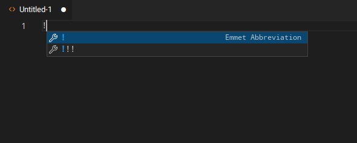
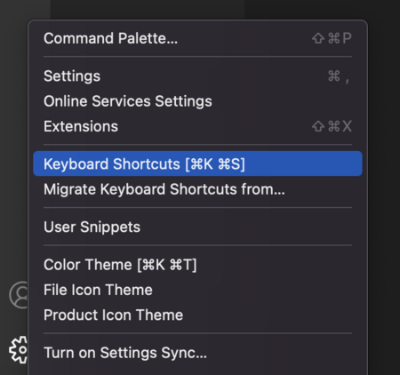
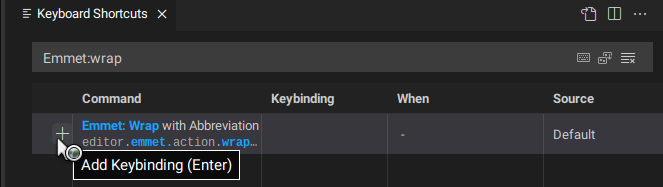

_**Curso Intermedio de HTML y CSS**_
# Emmet

## Introducción
Emmet es un plugin integrado en VS Code que te ayuda a escribir HTML y CSS de forma más eficiente, ofreciéndote una serie de atajos ingeniosos. Ya has escrito bastante HTML y CSS, y si has usado VS Code, es muy probable que ya te hayas topado con Emmet.

## Resumen de la lección
Esta sección contiene un resumen general de los temas que aprenderás en esta lección.

- Usa algunos de los atajos más útiles de Emmet.
- Configura atajos de teclado personalizados para Emmet en VS Code.

## Emmet
Emmet es una herramienta muy útil para quienes trabajan mucho con HTML y CSS. Por suerte, Emmet no tiene una curva de aprendizaje tan pronunciada, y si ya sabes escribir HTML y CSS, no tendrás problemas para entender las abreviaturas de Emmet.

Comencemos generando un código HTML repetitivo con Emmet. Abrir un archivo HTML vacío en VS Code e ingresar ! debería generar sugerencias de Emmet como las siguientes:



Pressing `Enter` should generate the following text:
```
<!DOCTYPE html>
<html lang="en">
<head>
    <meta charset="UTF-8">
    <meta name="viewport" content="width=device-width, initial-scale=1.0">
    <title>Document</title>
</head>
<body>
    
</body>
</html>
```
Acabamos de usar una de las muchas abreviaturas de Emmet. Hay muchas abreviaturas útiles de Emmet que deberías consultar, como [Envolver con abreviatura](https://docs.emmet.io/actions/wrap-with-abbreviation/) y Eliminar etiqueta. Revísalas antes de continuar.

Dada su utilidad, configuraremos atajos de teclado de VS Code para ellas. Comienza abriendo la ventana de atajos de teclado. Puedes hacerlo haciendo clic en el icono de engranaje en la esquina inferior izquierda y seleccionando atajos de teclado, o presionando `Cmd + K` seguido de `Cmd + S` en Mac, o `Ctrl + K` seguido de `Ctrl + S` en Windows/Linux.



Tras acceder a la ventana de atajos de teclado, debería poder acceder a todas las acciones de Emmet buscando `Emmet:<action>`. En nuestro caso, será `Emmet:Wrap With Abbreviation`.



Ahora puede agregar un atajo haciendo clic en el signo más e introduciendo la combinación de teclas que desee para esa acción específica. Puede hacer lo mismo para "Eliminar etiqueta" buscando `Emmet:Remove tag`.

### Tarea
1. Este [video sobre Emmet](https://www.youtube.com/watch?v=V8vizNQKtx0) muestra algunas maneras de usar Emmet para mejorar la productividad. Míralo hasta el minuto 11:37, ya que muestra contenido que aún no hemos cubierto. Ya llegaremos a eso.

2. Consulta la [hoja de trucos de Emmet](https://docs.emmet.io/cheat-sheet/). No es necesario que la memorices, pero es bueno que te familiarices con las diferentes maneras de usarla.

### Prueba de conocimientos
Las siguientes preguntas ofrecen la oportunidad de reflexionar sobre los temas clave de esta lección. Si no puede responder alguna pregunta, haga clic en ella para revisar el material, pero tenga en cuenta que no se espera que memorice ni domine este conocimiento.

* ¿Por qué debería usar Emmet?
* ¿Cuáles son algunas abreviaturas útiles de Emmet?
* ¿Qué sintaxis usaría para crear el elemento `<p class="text"></p>`?
* ¿Qué sintaxis se expande a un elemento con un elemento hijo dentro? Por ejemplo: `<div><p></p></div>`
* ¿Qué sintaxis usaría para crear tres elementos con el mismo nombre de clase?

### Recursos adicionales
Esta sección contiene enlaces útiles a contenido relacionado. No es obligatoria, así que considérela complementaria.

- [Emmet Keybindings](https://marketplace.visualstudio.com/items?itemName=agutierrezr.emmet-keybindings) de [Andrés Gutiérrez](https://agutierrezr.github.io/), es un conjunto de combinaciones de teclas de Emmet para Visual Studio Code. Puede usarse como un grupo predefinido de combinaciones de teclas, en caso de que no sepa qué asignar a qué tecla.

- [Emmet Live](https://marketplace.visualstudio.com/items?itemName=ysemeniuk.emmet-live) de [Yurii Semeniuk](https://github.com/semeniuk), es otra extensión de Visual Studio Code. Puede generar continuamente la estructura HTML correspondiente mientras edita las abreviaturas de Emmet. Para obtener el resultado deseado, intente seleccionar un fragmento de texto al azar antes de llamar a esta extensión.